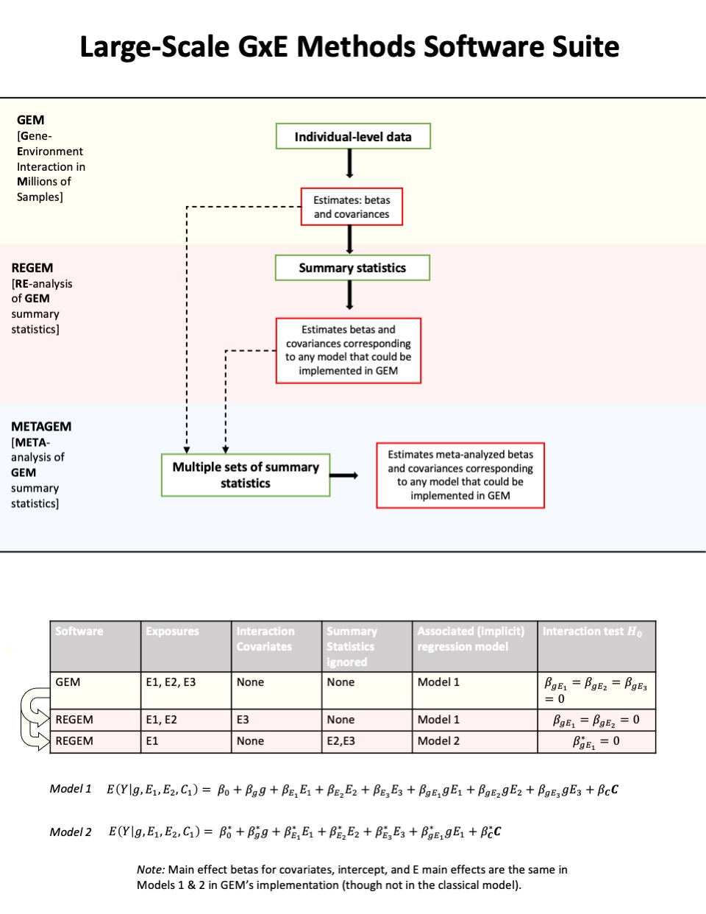

 
 

# Large-Scale GxE Methods Project
[Link to our project on NIH Reporter](https://reporter.nih.gov/search/gAoJB8GZC023oCHDlwkpCQ/project-details/10199014)

Welcome to the website for the Large-scale GxE Methods Project

### Research Question
The major goals of this project are to develop efficient methods and algorithms for large-scale gene-environment interaction studies, and implement them in open-source software programs and cloud-based analysis pipelines, to facilitate gene-environment interaction research on complex cardio-metabolic, lung, blood and sleep diseases and related conditions using hundreds of thousands to millions of samples.  

### Principal Investigators 
Han Chen, Alisa Manning

#### Approach 
Gene- environment interaction (GEI) studies allow us to understand the relationship between genetic variations and a phenotype in the presence of an exposure, which can be a lifestyle (e.g. cigarette smoking), an environmental exposure (e.g. toxin), a physiological factor (e.g. obesity), or a treatment intervention (e.g. daily aspirin therapy).

Both GEM and MAGEE are intended to enable genome-wide gene-environment interaction testing in large sample sizes through the use of a matrix projection approach and score-type test for computational efficiency. Both also incorporate key statistical capabilities for GEI analysis: including joint testing of multiple exposures and adjustment for gene-covariate interactions.

GEM is the most computationally efficient of the two and is currently intended for single-variant analysis unrelated samples. The software further allows the use of robust standard errors to prevent genomic inflation due to mis-specified environmental main effects. MAGEE allows more flexible modeling in multiple domains: MAGEE can operate in either common variant (single variant testing) or rare variant (aggregate set-based testing) modes and MAGEE can incorporate related individuals (along with arbitrary additional covariance matrices for individuals).

GEM and MAGEE are an open-source software packages hosted on GitHub (https://large-scale-gxe-methods.github.io/). The software packages use FAIR (findable, accessible, interoperable, and reusable) principles and integrates various data types, including sequencing data, functional genomic data, phenotypic data, and clinical data. The Global Alliance for Genomics and Health's (GA4GH) has an initiative to standardize analysis workflows and host them on an online platform called Dockstore. Currently, workflows for GEM version 1.4 and MAGEE have been written in Workflow Definition Language (WDL) and are available on Dockstore (https://dockstore.org/organizations/LSGxE).

#### GEM (Gene-Environment interaction analysis in Millions of Samples)
Kenneth E Westerman, Duy T Pham, Liang Hong, Ye Chen, Magdalena Sevilla-González, Yun Ju Sung, Yan V Sun, Alanna C Morrison, Han Chen, Alisa K Manning, [GEM: scalable and flexible gene–environment interaction analysis in millions of samples, Bioinformatics, Volume 37, Issue 20, 15 October 2021, Pages 3514–3520](https://doi.org/10.1093/bioinformatics/btab223)

We developed a new software program, GEM (Gene-Environment interaction analysis in Millions of samples) as part of R01 HL145025 (Multi-PI’s Manning/Chen), which supports the inclusion of multiple GEI terms and adjustment for GEI covariates, conducts both model-based and robust inference procedures, and enables multi-threading to reduce computational time.

Through simulations, we demonstrate that GEM enables genome-wide GEI analysis that scales to millions of samples while addressing limitations of existing software programs. In order to further assess the value of genome-wide GEI testing, we conducted a gene-by-sex interaction analysis on body mass index (BMI)-adjusted waist-hip ratio (WHR) in 352,768 unrelated individuals of European ancestry from the UK Biobank.

By testing for sex-by-genotype interaction, we identified 6 novel loci that have not been previously reported as sex-dimorphic for WHR. Using the joint test of both genetic and GEI effects, we identified 39 novel loci that have not been previously reported in sex-specific or combined analyses. Furthermore, through analysis of down-sampled datasets, we showed that the degree of polygenicity is similar for interaction and marginal effects. Our results demonstrate the value of explicit GEI testing in large sample sizes and shed light on the polygenic architecture of sex interaction effects for WHR.

#### MAGEE (Mixed-model Association tests for GEne-Environment interactions)

Wang, X., Lim, E., Liu, C. T., Sung, Y. J., Rao, D. C., Morrison, A. C., Boerwinkle, E., Manning, A. K., & Chen, H. (2020). [Efficient gene-environment interaction tests for large biobank-scale sequencing studies. Genetic epidemiology, 44(8), 908–923](https://www.ncbi.nlm.nih.gov/pmc/articles/PMC7754763/)

Mixed-model Association tests for Gene-Environment interactions (MAGEE) is an R package that was developed as part of R01HL145025 (Multi-PI’s Manning/Chen). MAGEE provides a computationally efficient variant set-based mixed model for conducting genome-wide gene-environment interaction (GEI) tests and joint tests.

Through simulation studies, we have shown MAGEE successfully controls type 1 errors in both unrelated and related samples, accounts for sample relatedness using GLMMs, and reduces the computational complexity for testing each variant. MAGEE can be applied to both quantitative and binary traits in large biobank-scale related individuals.

For real data applications, we applied MAGEE to the WES data from the UK Biobank. The results showed MAGEE p values were well calibrated and we identified an association between BMI and MC4R gene from the joint test. Although significant p values were not found from the interaction test, it is possible that interaction effects may be too small to identify in 41,144 samples. As the WES project is ongoing in the UK Biobank, we hope to revisit gene-environment interaction analyses when WES data from more UK Biobank samples are released in the coming years.

